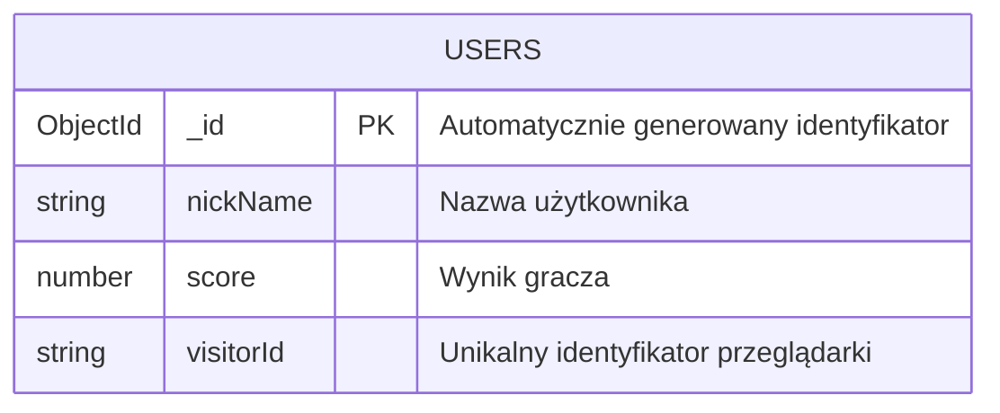

# Knowledge Game - Opis projektu

## Problem
Nauka teorii programowania i IT bywa nudna i monotonna. Tradycyjne quizy nie angażują użytkowników wystarczająco, co prowadzi do niskiej motywacji i słabszego przyswajania wiedzy.

## Rozwiązanie
**Knowledge Game** to edukacyjna gra webowa łącząca mechanikę arcade z quizem wiedzy. Gracz steruje robotem, który strzela pociskami w planety oznaczone odpowiedziami A, B, C, D - w ten sposób udziela odpowiedzi na pytania z zakresu programowania i IT.

## Cel
Zwiększenie zaangażowania w naukę poprzez gamifikację - gracz uczy się, bawiąc się.

## Uzasadnienie wyboru technologii aplikacji internetowej

### 1. Natychmiastowa dostępność bez instalacji
Aplikacja webowa działa w przeglądarce - użytkownik nie musi pobierać ani instalować żadnego oprogramowania. Wystarczy kliknąć link i rozpocząć grę. To eliminuje barierę wejścia i zwiększa konwersję użytkowników.

### 2. Wieloplatformowość (cross-platform)
Jedna wersja aplikacji działa na wszystkich urządzeniach i systemach operacyjnych (Windows, macOS, Linux, Android, iOS). Nie trzeba tworzyć osobnych wersji dla każdej platformy, co znacząco redukuje koszty rozwoju i utrzymania.

### 3. Łatwa dystrybucja i aktualizacje
Aktualizacje są wdrażane centralnie na serwerze - wszyscy użytkownicy natychmiast korzystają z najnowszej wersji bez konieczności ręcznego pobierania. Ułatwia to również A/B testy i szybkie poprawki błędów.

### 4. Centralna baza wyników i współzawodnictwo
Technologia webowa z backendem (Express.js + MongoDB) umożliwia przechowywanie wyników wszystkich graczy w jednej bazie danych. Dzięki temu możliwe jest tworzenie globalnych rankingów i rywalizacja między użytkownikami, co zwiększa motywację do nauki.

## Wymagania funkcjonalne

### WF1. Rejestracja gracza
System umożliwia wprowadzenie nazwy użytkownika przed rozpoczęciem gry. Gracz może również skonfigurować opcję zmniejszania żyć przy błędnych odpowiedziach.

### WF2. Rozgrywka z quizem
System wyświetla pytania z bazy wiedzy wraz z czterema możliwymi odpowiedziami (A, B, C, D) przypisanymi do planet. Gracz udziela odpowiedzi poprzez trafienie pociskiem w odpowiednią planetę w czasie nie dłuższym niż 30 sekund.

### WF3. System punktacji i żyć
System nalicza punkty za poprawne odpowiedzi oraz (opcjonalnie) odejmuje życia za błędne. Po wyczerpaniu żyć lub zakończeniu pytań gra kończy się i wyświetlany jest wynik końcowy.

### WF4. Tablica wyników
System zapisuje wyniki graczy w bazie danych i wyświetla ranking najlepszych wyników. Gracz po zakończeniu gry widzi swoją pozycję w rankingu oraz może rozpocząć rozgrywkę ponownie.

## Wymagania pozafunkcjonalne

### WPF1. Bezpieczeństwo
Aplikacja wymusza połączenie HTTPS oraz stosuje nagłówki bezpieczeństwa Content Security Policy (CSP) przy użyciu biblioteki Helmet. Chroni to przed atakami XSS i innymi zagrożeniami webowymi.

### WPF2. Wydajność i responsywność
Gra musi działać płynnie z minimalną liczbą klatek 30 FPS na standardowych urządzeniach. Czas ładowania strony nie powinien przekraczać 3 sekund przy połączeniu szerokopasmowym.

### WPF3. Skalowalność
Architektura aplikacji (Express.js + MongoDB + Docker) umożliwia łatwe skalowanie horyzontalne w środowisku chmurowym oraz obsługę wielu jednoczesnych użytkowników.

## Potencjalni odbiorcy systemu

### 1. Studenci i osoby uczące się programowania
Główna grupa docelowa to osoby rozpoczynające naukę programowania lub przygotowujące się do egzaminów i certyfikacji. Gra pozwala im w atrakcyjny sposób utrwalać wiedzę teoretyczną z zakresu IT (typy danych, standardy kodowania, .NET, SQL, HTTP).

### 2. Nauczyciele i wykładowcy informatyki
Edukatorzy mogą wykorzystać grę jako narzędzie dydaktyczne do uatrakcyjnienia zajęć. Forma rywalizacji i ranking wyników motywuje studentów do aktywnego uczestnictwa w lekcjach.

### 3. Rekruterzy i działy HR firm IT
Aplikacja może służyć jako narzędzie wstępnej weryfikacji wiedzy kandydatów podczas procesów rekrutacyjnych. Gamifikacja zmniejsza stres związany z testami technicznymi.

## Dokumentacja techniczna

### 1. Stos technologiczny

#### Frontend
- **JavaScript (ES6+)** - logika gry, interakcje
- **HTML5 Canvas API** - renderowanie grafiki 2D
- **CSS3** - stylowanie interfejsu

#### Backend
- **Node.js** - środowisko uruchomieniowe
- **Express.js 4.19.2** - framework serwera HTTP
- **body-parser 1.20.2** - parsowanie JSON i form data

#### Baza danych
- **MongoDB 6.7** - przechowywanie wyników graczy

#### Bezpieczeństwo
- **Helmet 7.1.0** - nagłówki bezpieczeństwa (CSP)
- **express-force-https 1.0.0** - wymuszenie HTTPS

#### DevOps i deployment
- **Docker** - konteneryzacja aplikacji
- **Docker Compose** - orkiestracja kontenerów
- **Nginx** - reverse proxy
- **Heroku** - hosting produkcyjny
- **Nodemon** - hot-reload w środowisku dev

### 2. Struktura bazy danych (MongoDB)

#### Diagram kolekcji



#### Schemat dokumentu kolekcji `Users`

**Baza danych:** `UsersDb`  
**Kolekcja:** `Users`

| Pole | Typ | Opis |
|------|-----|------|
| `_id` | ObjectId | Unikalny identyfikator dokumentu (generowany automatycznie przez MongoDB) |
| `nickName` | String | Nazwa użytkownika wprowadzona przy rejestracji |
| `score` | Number | Liczba punktów zdobytych przez gracza |
| `visitorId` | String | Unikalny identyfikator sesji/przeglądarki gracza |

#### Przykładowy dokument

```json
{
    "_id": ObjectId("507f1f77bcf86cd799439011"),
    "nickName": "Gracz123",
    "score": 850,
    "visitorId": "abc123def456"
}
```

### 3. Uzasadnienie wyboru technologii

#### Dlaczego MongoDB zamiast relacyjnej bazy danych?

1. **Prostota modelu danych** - aplikacja przechowuje tylko jeden typ dokumentu (wyniki graczy) bez relacji między tabelami. Nie ma potrzeby stosowania JOIN-ów, kluczy obcych ani normalizacji.

2. **Elastyczny schemat** - w MongoDB można łatwo rozszerzyć strukturę dokumentu o nowe pola (np. data gry, liczba pytań) bez migracji schematu i modyfikacji istniejących rekordów.

3. **Naturalna zgodność z JavaScript/JSON** - dokumenty MongoDB są zapisywane w formacie BSON (binarny JSON), co eliminuje potrzebę mapowania obiektowo-relacyjnego (ORM). Dane z frontendu trafiają bezpośrednio do bazy.

4. **Szybkość zapisu** - zapis pojedynczego dokumentu jest bardzo wydajny, co jest istotne przy częstym zapisywaniu wyników wielu graczy jednocześnie.

5. **Łatwa skalowalność horyzontalna** - MongoDB natywnie wspiera sharding, co ułatwia skalowanie przy wzroście liczby użytkowników.

#### Dlaczego Vanilla JavaScript zamiast React/Angular?

1. **Bezpośredni dostęp do Canvas API** - gra wykorzystuje HTML5 Canvas do renderowania grafiki 2D. Frameworki jak React używają Virtual DOM, który jest zbędnym pośrednikiem przy bezpośredniej manipulacji pikseli na Canvas. Vanilla JS daje pełną kontrolę nad pętlą renderowania.

2. **Wydajność w grach** - gry wymagają renderowania 30-60 klatek na sekundę. Narzut frameworka (reconciliation, diffing) mógłby negatywnie wpłynąć na płynność animacji. Vanilla JS eliminuje ten overhead.

3. **Brak potrzeby zarządzania stanem UI** - aplikacja nie ma złożonego interfejsu z wieloma komponentami i zagnieżdżonymi stanami. Stan gry (pozycja robota, pociski, planety) jest zarządzany bezpośrednio w pętli gry.

4. **Mniejszy rozmiar aplikacji** - brak zależności od dużych bibliotek (React ~40KB, Angular ~150KB gzipped) oznacza szybsze ładowanie strony, co jest kluczowe dla gry uruchamianej w przeglądarce.

5. **Prostota wdrożenia** - nie wymaga procesu budowania (build), bundlerów (Webpack, Vite) ani transpilacji. Pliki JS są serwowane bezpośrednio przez Express.

6. **Cel edukacyjny** - projekt demonstruje fundamenty programowania gier w JavaScript bez abstrakcji frameworków, co jest wartościowe dla osób uczących się podstaw.


